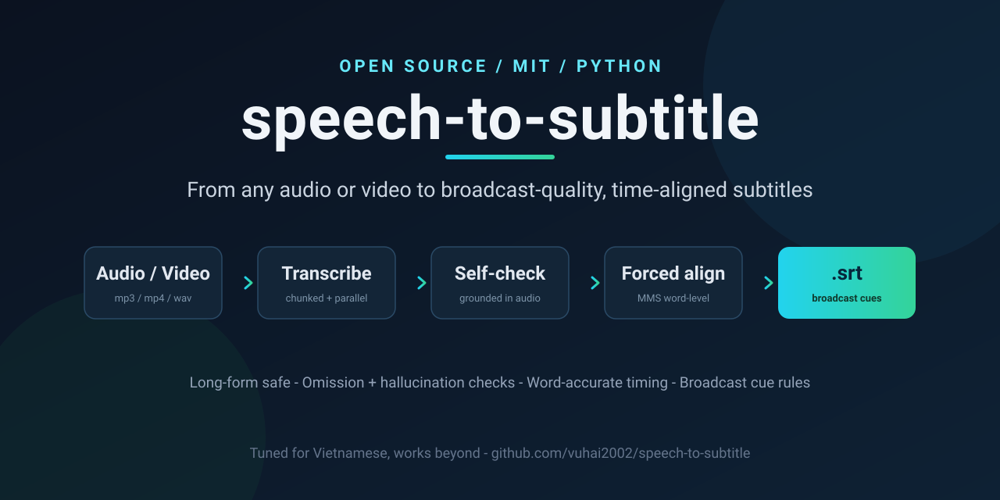

<p align="center">
  
</p>

# speech-to-subtitle

**Turn any audio or video into a clean transcript or broadcast-quality, time-aligned subtitles.**

A pure-code, self-checking pipeline built for **long-form speech** (1-2 hour lectures, talks, sermons, podcasts). It transcribes with a large speech model, verifies the transcript against the audio to catch dropped or hallucinated words, then forced-aligns every word to produce `.srt` subtitles that follow professional broadcast timing rules (Netflix / BBC / ESIST).

Originally built and battle-tested on Vietnamese lecture audio (1,700+ hours subtitled), the pipeline is language-general: swap the model and it works for other languages too.

---

## Why this exists

Most "audio to subtitle" tools break on long files: the model **silently skips** a passage, or the timing **drifts later and later** toward the end of the video (a classic failure of splitting time by character count). This pipeline is designed specifically to survive both.

- **Long-form safe.** Audio is cut at silence into ~10-minute chunks and transcribed in parallel. Sending a whole 90-minute file makes models quietly omit a passage; chunking eliminates that.
- **Self-checking, grounded in the audio.** After transcribing, it forced-aligns with a "star" gap token: any stretch of speech with no matching words is flagged as a likely **omission**, and words landing in silence are flagged as **hallucination**. A plain confidence score never catches these; anchoring to the audio does.
- **Two-pass consensus.** Transcribe twice (two runs or two different models) and diff them. Where two independent ASR systems agree, you can trust it; where they differ is exactly what to re-listen to. Two independent engines agreed **97%** on a 106-minute lecture in testing.
- **Word-accurate timing.** MMS forced alignment anchors each word to where it is actually spoken, so any error stays local instead of accumulating toward the end.
- **Broadcast-quality cues.** Cues are built to real subtitle standards: max reading speed (CPS), characters per line, max lines, minimum display time, gap between cues, and clean two-line wrapping.
- **Deterministic and resumable.** Pure code, no AI in the timing loop. Parallel workers, automatic retries, cached alignment, safe to re-run.

---

## Pipeline

```
Audio or video file  (mp3, m4a, wav, mp4, ...)
   |
   |  STEP 1  Transcribe
   |          Cut at silence into ~10-min chunks -> transcribe in parallel
   |          -> self-check against the audio (omission / hallucination)
   v
Transcript (.txt)      clean prose, punctuation, no timing
   |
   |  STEP 2  Align
   |          MMS forced alignment anchors every word to the audio,
   |          then cues are built under broadcast subtitle rules
   v
Subtitles (.srt)   +   per-word timing cache (.json)
```

Why two steps: speech models transcribe words accurately but do not give reliable timing. Forced alignment pins each word to its real position in the audio, so timing errors stay local instead of drifting.

---

## Transcription backends

The transcribe step is pluggable. Pick per your budget and constraints:

| Backend | How | Cost | Notes |
|---|---|---|---|
| **Gemini on Vertex AI** | `transcribe/batch_transcribe_vertex.py` | Google Cloud billing | Reference path. Sends audio by GCS URI, billed on real audio tokens. |
| **Router (OpenAI-compatible)** | `transcribe/chunked_transcribe/` | depends on router | Experimental. Chunked + audio-grounded QC + two-pass compare. |
| **MAI-Transcribe-2 (OpenRouter)** | `transcribe/mai_transcribe/` | ~$0.10 / hour of audio | Experimental. Returns **word-level timestamps natively**, so it can build `.srt` **without the alignment step or a GPU**. |

The `realign/` alignment stage (STEP 2) works with any transcript, from any of these backends or your own.

---

## Quickstart

### Requirements

- **Transcribe (STEP 1):** Python 3.10+. Backend-specific deps (e.g. `google-genai` for Vertex).
- **Align (STEP 2):** Python 3.12, an NVIDIA GPU (runs on 4 GB), `torch` + `torchaudio` (CUDA build), `soundfile`, `uroman`, `silero-vad`. On first run, `torchaudio` downloads the MMS_FA model (~1.2 GB).

```bash
python -m venv --system-site-packages .venv
.venv/Scripts/python.exe -m pip install torch==2.5.1 torchaudio==2.5.1 --index-url https://download.pytorch.org/whl/cu121
.venv/Scripts/python.exe -m pip install soundfile uroman silero-vad
```

### STEP 1 - transcribe to text

```bash
# Vertex (reference): copy .env.example -> .env, fill in per docs/vertex-ai-setup-guide.md
python transcribe/batch_transcribe_vertex.py --mp3-dir ./audio --txt-dir ./txt --workers 5
```

```bash
# MAI (cheap, native word timestamps): set OPENROUTER_API_KEY
.venv/Scripts/python.exe -m transcribe.mai_transcribe.run_pipeline --input talk.m4a --out-dir out-mai
```

### STEP 2 - align and make subtitles

```bash
.venv/Scripts/python.exe -m realign.run_batch --txt-dir ./txt --audio-dir ./audio --out-dir out --device cuda --window-sec 1500
```

Output lands in `out/srt/<name>.srt`, with a per-word cache in `out/words/<name>.json` and a `out/manifest.csv` summary (words aligned, cue count, mean alignment confidence).

For the MAI path, subtitles come straight from its native timestamps, no GPU needed:

```bash
.venv/Scripts/python.exe -m transcribe.mai_transcribe.build_srt --out-dir out-mai
```

---

## Quality controls in depth

- **Chunking at silence.** VAD (silero) finds speech; chunks are cut in the longest silence near each ~10-minute mark, so no word is split across chunks.
- **Audio-grounded QC** (`chunked_transcribe/quality_check.py`). MMS alignment with a star gap token surfaces speech-without-words (omission) and words-in-silence (hallucination). Thresholds are configurable.
- **Two-pass compare** (`chunked_transcribe/compare_passes.py`, `render_compare_html.py`). Word-level diff of two transcripts, with an HTML side-by-side view highlighting disagreements.
- **Windowed alignment for long files** (`realign/window_align.py`). Full-file forced alignment on a 1-2 hour file needs tens of GB of RAM; windowing at silence points cuts that to ~2 GB while aligning 99.9% of words.
- **Cue rules** (`realign/config.py`, all thresholds in one place): CPS (reading speed), characters per line, max lines, min/max display time, inter-cue gap, greedy two-line wrapping, and boundary de-isolation for stray one-word cues.

---

## Repository layout

```
speech-to-subtitle/
  transcribe/                 STEP 1: audio -> text
    batch_transcribe_vertex.py    Gemini via Vertex AI (reference)
    chunked_transcribe/           router backend: chunk + self-check + compare
    mai_transcribe/               MAI-Transcribe-2: native word timestamps
  realign/                    STEP 2: text + audio -> srt (forced alignment)
  tests/realign/              pytest for the realign package
  tools/drive-batch-prep/     helpers for preparing large audio batches
  docs/                       architecture, backend setup, design notes
  .env.example                configuration template
```

## Subtitle standards

Cue defaults follow common broadcast guidelines (Netflix, BBC, ESIST): up to 42 characters per line, 2 lines, max reading speed 15 CPS, minimum display 1.5 s, maximum 7 s, and a small gap between cues so subtitles do not flicker. Every threshold lives in `realign/config.py` and is passed through, so you can retune without touching logic.

## Documentation

- `docs/system-architecture.md` - data contract, cue rules, long-file handling inside `realign/`.
- `docs/vertex-ai-setup-guide.md` - Google Cloud setup for the Vertex backend.
- `transcribe/chunked_transcribe/README.md` and `docs/chunked-transcribe-notes.md` - the router backend, with experiments and evidence.
- `transcribe/mai_transcribe/README.md` and `docs/mai-transcribe-notes.md` - the MAI backend, with benchmarks vs Gemini+MMS.

## Language support

Built and validated on Vietnamese (tone marks and all). The alignment stage romanizes text with `uroman` before MMS, and the speech models are multilingual, so the same pipeline generalizes to other languages by changing the transcription model and cue-rule tuning.

## License

MIT - see [LICENSE](LICENSE). Created by Vũ Văn Hải.
